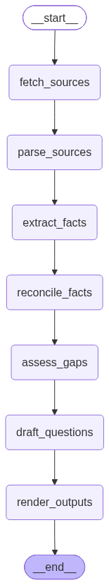

# SunBridge Task 2 (China -> Bangladesh)

An agentic pipeline that reads three incomplete, partly disagreeing sources and produces a
compliance draft that SunBridge can circulate internally, every value attributed to the document
it came from, and every gap named rather than quietly dropped.

The pipeline extracts facts from each source and compares them to the checklist, producing a draft of questions for the factory.

## How to run it?

```bash
git clone https://github.com/dipenpandit/cantordust-task2.git
cd cantordust-task2

uv venv
source .venv/bin/activate      # Windows: .venv\Scripts\activate
uv sync

# Create a .env file and enter your API keys (look at .env.example for the format)
python main.py
```

`.env` needs:

```
GEMINI_API_KEY=...
LLAMA_CLOUD_API_KEY=...
```

Outputs land in `output/`:

| File | What it is |
| --- | --- |
| `draft.md` | The human readable draft after processing all sources |
| `extracted.json` | Every field extracted from the sources, and their values, confidence, and supporting quotes |
| `parsed_datasheet.md` | The parsed form of the datasheet provided by the manufacturer containing the extracted product specifications |

## Pipeline



---

## 1. Fetching the sources

All three sources live in `sources/`:

```
sources/
  datasheet.pdf        downloaded from the manufacturer's public link
  buyer_form.json      the buyer form from the brief, as JSON
  call_notes.txt       Ramesh's call notes from the brief, verbatim
```

**Assumptions**

- The buyer form is structured as JSON since the task described it as a form. It could have been a CSV file too but I deicided to go with JSON.
- The call notes are provided as text as I used it a Text file too. 
- Similarly, the datasheet is provided as a PDF file. The pipeline does not attempt to fetch any of these using `url` for simplicity. 


## 2. Parsing 

The datasheet is a specification table with several irregular cells. So, as described in the task. It was indeed quite challenging. 

**First approach:**

I tried pdfplumber which has a table extraction feature. I experimented with three table strategies: `lines`, `lines_strict` and `text`.

What these table strategies mean?

- **`lines`** find cell boundaries from the ruling lines actually drawn in the PDF, including thin filled rectangles that look like lines. Works when a table is properly ruled. 
- **`lines_strict`** the same, but only counts real line and curve objects and ignores rectangles pretending to be borders. Stricter, so it produces fewer phantom cells on tables where shading is mistaken for a border.
- **`text`** no lines at all: infer rows and columns from where the words align. `snap_tolerance` merges edges within 3 points of each other, `join_tolerance` joins segments within 3 points into one line. The fallback for tables drawn with whitespace instead of rules.

**Result:** `lines` and `lines_strict` returned no values or incomplete values for the rows with merged cells. FInally the
`text` strategy was able to extract the values and rows but it was not able to differentiate the spacing between the columns and values. 

### What was considered next

- **Plain OCR (Tesseract etc.)** was rejected because they might give the text and their bounding boxes but for actual table reconstruction, I would have had to add a new tablle construction layer on top of that. Considering the time, I decided to go with a more robust solution.
- **LlamaParse** is an LLM-backed parser that parses the contents of a pdf into a layout-aware markdown. But there was a problem again, the model name header has the model name split into two lines, so the parser kind of split them into two rows. But, It was fixed by changint the `tier` parameter to `cost-effective` instead of the the default `fast`. 


**Final approach: LlamaParse**

With LlamaParse table came back as markdown with the model
columns intact and the row labels attached. The parsed markdown is written to
`output/parsed_datasheet.md` on every run.

**Assumptions**

- The LlamaParse will be able to parse other similar datasheets as well. I didn't have other similar docs to check, but the pipeline is designed to be generic.


## 3. Extracting facts

For extracting facts, we just need one LLM call per source. So, for three sources three calls were made and the facts were extracted based on the cannonical field list from the task's import checklist. The canonical field list from the task's import checklist is embedded in the extraction
prompt. Then the facts are exracted using a structured output. The schema for the structured output is defined in the code below:

```python
{
  "facts": [
    {
      "field": "field_name",
      "value": "extracted value",
      "quote": "short supporting quote or row name",
      "confidence": "high | medium | low",
      "source": "datasheet | buyer_form | call_notes"
    }
  ]
}
```

**Assumptions**

- Confidence is the model's own judgement, prompted to be `low` when the layout made a value ambiguous. 
- Missing information should be omitted rather than guessed.
- Field names are matched by exact string after lowercasing. Two sources naming the same thing differently won't be compared.


## 4. Reconciling

The extracted facts are grouped by field and only invokes the LLM when the same field appears across multiple sources.  
nothing to compare, so there is nothing to spend a call on. The LLM compares the competing claims and classifies them as either `agreed` or `conflict`. Importantly, reconciliation determines whether claims are compatible; it does not decide which conflicting source is correct.

The prompt is explicit that the model must **not** decide who is right. Where the sources
disagree, both values are printed side by side with their sources and neither is overruled —
that's the client's instruction and it's also the honest position.

**Assumptions**

- The datasheet is a published document, the buyer form is what the buyer wrote down, and the call notes are hearsay. None of these documents are used to pick a winner or decide which is correct. The model is instructed to report the disagreement, not resolve it.
- Differences such as units, rounding, or abbreviated identifiers can still represent agreement.("5 kW" vs "5000 W", a model number vs its abbreviated form) counts as agreement, with the abbreviation flagged in the note.


## 5. Gaps, questions and the draft
It maps the reconciled facts against a predefined compliance checklist covering product identity, manufacturer identity, test evidence, labeling, and importer paperwork. Each field receives a status such as established, conflict, verbal only, unverified, or pending. 

| Status | Meaning |
| --- | --- |
| `established` | Backed by the datasheet |
| `conflict` | The sources disagree; both shown |
| `verbal_only` | Said on a call, nothing in writing |
| `unverified` | Present, but not from the datasheet |
| `pending` | No source mentions it at all |

Anything the model extracted outside that checklist is kept under **Other extracted fields**
rather than dropped.

`draft_questions` then derives the questions for the factory from those statuses: one per
conflict, one per verbal-only claim, one per missing field. None are written by hand, so a
different datasheet produces a different list automatically.

`render_outputs` writes the JSON and renders the Markdown **from that JSON, deterministically without any LLM call**. 
The product name, buyer and destination in the header are read from the extracted facts, not
configured, so nothing specific to this product is hardcoded in the draft. The draft is written to `output/draft.md` and the extracted facts to `output/extracted_facts.json`.

**Assumptions**

- A missing field is a finding, not a failure. 


## Known limits

- LlamaParse quality was verified by eye and for one datasheet rather than by a test.

